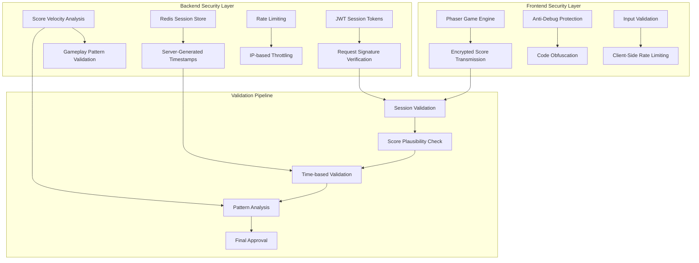

# MonDefense Security Enhancement Design

## Overview

MonDefense is currently vulnerable to console-based score hacking through the exposed `window.submitGameScore` global function. A comprehensive security enhancement is needed to implement robust server-side validation, session management, and score verification to prevent fraudulent score submissions while maintaining legitimate gameplay functionality.

**Project Structure:**
- Frontend: `C:\Users\PC\Documents\augment-projects\MonDefense\` (Next.js)
- Backend: `C:\Users\PC\Documents\augment-projects\MonDefense\backend\` (Node.js/Express)
- Separate Git repositories for frontend and backend
- Redis integration required for session storage

## Architecture

### Current Security Vulnerabilities

```mermaid
graph TD
    A[Browser Console] -->|window.submitGameScore()| B[Direct Score Submission]
    B --> C[API Endpoint /submit-score]
    C --> D[Blockchain Contract]
    
    E[Phaser Game] -->|Legitimate Score| B
    
    F[Minimal Validation] --> C
    G[No Rate Limiting] --> C
    H[Client-Side Timestamps] --> C
```

**Critical Issues:**
- Global function exposure allows direct console manipulation
- No server-side session validation with Redis
- Client-provided timestamps are trusted
- Insufficient score validation against realistic gameplay metrics
- Missing comprehensive rate limiting and anti-fraud measures

### Enhanced Security Architecture



## Backend Implementation Structure

### Directory Structure
```
backend/
├── src/
│   ├── controllers/
│   │   ├── sessionController.js
│   │   ├── scoreController.js
│   │   └── authController.js
│   ├── middleware/
│   │   ├── sessionValidation.js
│   │   ├── rateLimiting.js
│   │   └── scoreValidation.js
│   ├── services/
│   │   ├── redisService.js
│   │   ├── scoreValidationService.js
│   │   └── antiFraudService.js
│   ├── models/
│   │   ├── SessionModel.js
│   │   └── ScoreModel.js
│   ├── utils/
│   │   ├── crypto.js
│   │   └── validation.js
│   └── app.js
├── config/
│   ├── redis.js
│   ├── database.js
│   └── security.js
├── tests/
│   ├── security.test.js
│   └── validation.test.js
├── package.json
├── .env.example
└── README.md
```

### Technology Stack for Backend
- **Runtime:** Node.js >=18
- **Framework:** Express.js
- **Session Store:** Redis
- **Authentication:** JWT
- **Validation:** Joi/Zod
- **Rate Limiting:** express-rate-limit
- **Security:** helmet, cors, crypto-js
- **Monitoring:** winston (logging)

## API Endpoints Reference

### Enhanced Session Management

#### POST /api/start-game-session
**Enhanced Security Implementation:**

```typescript
interface StartGameSessionRequest {
  walletAddress: string;
  clientFingerprint: string;  // Device/browser fingerprint
  gameVersion: string;        // Client version validation
}

interface StartGameSessionResponse {
  sessionToken: string;       // JWT with 10-minute expiry
  sessionId: string;         // Redis session key
  serverChallenge: string;   // Cryptographic challenge
  maxSessionDuration: number; // 600 seconds (10 minutes)
}
```

**Redis Session Data:**
```typescript
interface SessionData {
  sessionId: string;
  walletAddress: string;
  startTime: number;          // Server-generated timestamp
  maxDuration: number;        // 600 seconds
  scoreSubmitted: boolean;    // One score per session
  gameEvents: GameEvent[];    // Tracked game actions
  rateLimit: {
    requests: number;
    lastRequest: number;
  };
}
```

#### POST /api/submit-score
**Enhanced Validation Pipeline:**

```typescript
interface SecureSubmitScoreRequest {
  sessionId: string;
  scoreAmount: number;
  gameData: {
    waveCount: number;
    actionsPerformed: number;
    gameplayEvents: GameEvent[];
  };
  clientSignature: string;    // HMAC of game data
}

interface ValidationResult {
  isValid: boolean;
  reason?: string;
  scoreModifier?: number;     // Apply penalties for suspicious activity
}
```

## Data Models & Session Management

### Redis Session Schema

```typescript
// Redis Key Pattern: session:{sessionId}
interface RedisSessionData {
  // Session Metadata
  sessionId: string;
  walletAddress: string;
  startTime: number;          // Server timestamp (UTC)
  expiryTime: number;         // Auto-expire after 10 minutes
  
  // Game State Tracking
  gameState: {
    currentWave: number;
    enemiesDefeated: number;
    actionsPerformed: number;
    lastActionTime: number;
  };
  
  // Security Metrics
  security: {
    scoreSubmitted: boolean;   // One submission per session
    requestCount: number;      // Track API requests
    lastRequestTime: number;
    suspiciousActivity: string[];
  };
  
  // Performance Baselines
  performance: {
    avgPointsPerSecond: number;
    maxRealisticScore: number;
    minSessionTime: number;    // 30 seconds minimum
  };
}
```

### Score Validation Rules

```typescript
interface ScoreValidationRules {
  // Temporal Validation
  minSessionDuration: 30;     // seconds
  maxSessionDuration: 600;    // 10 minutes
  
  // Performance Validation
  maxPointsPerSecond: 15;     // Based on 20+ gameplay sessions
  minPointsPerSecond: 0.1;    // Detect inactive sessions
  
  // Session Integrity
  maxSubmissionsPerSession: 1;
  maxRequestsPerMinute: 10;
  
  // Game Logic Validation
  pointsPerWave: {
    min: 10;
    max: 500;
  };
  maxWavesIn10Minutes: 50;
}
```

## Business Logic Layer

### Backend Service Implementation

#### Redis Service (`src/services/redisService.js`)
```javascript
const redis = require('redis');
const client = redis.createClient({
  host: process.env.REDIS_HOST || 'localhost',
  port: process.env.REDIS_PORT || 6379,
  password: process.env.REDIS_PASSWORD,
  db: process.env.REDIS_DB || 0
});

class RedisService {
  async createSession(walletAddress) {
    const sessionId = this.generateSessionId();
    const sessionData = {
      sessionId,
      walletAddress,
      startTime: Date.now(), // Server-generated timestamp
      expiryTime: Date.now() + (10 * 60 * 1000), // 10 minutes
      scoreSubmitted: false,
      requestCount: 0,
      gameState: {
        currentWave: 0,
        enemiesDefeated: 0,
        actionsPerformed: 0
      }
    };
    
    await client.setex(`session:${sessionId}`, 600, JSON.stringify(sessionData));
    return sessionData;
  }
  
  async getSession(sessionId) {
    const data = await client.get(`session:${sessionId}`);
    return data ? JSON.parse(data) : null;
  }
  
  async updateSession(sessionId, updates) {
    const session = await this.getSession(sessionId);
    if (!session) return null;
    
    const updatedSession = { ...session, ...updates };
    await client.setex(`session:${sessionId}`, 600, JSON.stringify(updatedSession));
    return updatedSession;
  }
}

module.exports = new RedisService();
```

### Score Validation Service (`src/services/scoreValidationService.js`)

```javascript
class ScoreValidationService {
  async validateScoreSubmission(
    sessionId: string, 
    scoreData: SubmitScoreRequest
  ): Promise<ValidationResult> {
    
    // 1. Session Validation
    const session = await this.redis.get(`session:${sessionId}`);
    if (!session) {
      return { isValid: false, reason: 'Invalid session' };
    }
    
    // 2. Temporal Validation
    const sessionDuration = Date.now() - session.startTime;
    const pointsPerSecond = scoreData.scoreAmount / (sessionDuration / 1000);
    
    if (pointsPerSecond > VALIDATION_RULES.maxPointsPerSecond) {
      return { 
        isValid: false, 
        reason: `Score too high: ${pointsPerSecond} pts/sec exceeds ${VALIDATION_RULES.maxPointsPerSecond}` 
      };
    }
    
    if (sessionDuration < VALIDATION_RULES.minSessionDuration * 1000) {
      return { 
        isValid: false, 
        reason: `Session too short: ${sessionDuration}ms` 
      };
    }
    
    // 3. One Score Per Session
    if (session.security.scoreSubmitted) {
      return { isValid: false, reason: 'Score already submitted for this session' };
    }
    
    // 4. Rate Limiting
    const requestsInLastMinute = await this.checkRateLimit(session.walletAddress);
    if (requestsInLastMinute > VALIDATION_RULES.maxRequestsPerMinute) {
      return { isValid: false, reason: 'Rate limit exceeded' };
    }
    
    return { isValid: true };
  }
}
```

### Anti-Fraud Detection Engine

```typescript
class AntiFraudEngine {
  async analyzeGameplayPattern(sessionData: RedisSessionData): Promise<FraudRisk> {
    const riskFactors = [];
    
    // Pattern Analysis
    if (sessionData.gameState.actionsPerformed === 0) {
      riskFactors.push('No game actions recorded');
    }
    
    const averageActionInterval = 
      (Date.now() - sessionData.startTime) / sessionData.gameState.actionsPerformed;
    
    if (averageActionInterval < 100) { // Actions too frequent
      riskFactors.push('Unrealistic action frequency');
    }
    
    // Score Velocity Analysis
    const scoreVelocity = this.calculateScoreVelocity(sessionData);
    if (scoreVelocity > this.establishedBaseline.maxVelocity) {
      riskFactors.push('Score velocity exceeds baseline');
    }
    
    return {
      riskLevel: riskFactors.length > 2 ? 'HIGH' : 'LOW',
      factors: riskFactors
    };
  }
}
```

## Middleware & Security Interceptors

### Request Validation Middleware

```typescript
class SecurityMiddleware {
  // Session Token Validation
  async validateJWTSession(req: Request, res: Response, next: NextFunction) {
    const token = req.headers.authorization?.replace('Bearer ', '');
    
    try {
      const decoded = jwt.verify(token, process.env.JWT_SECRET) as SessionData;
      
      // Verify session exists in Redis
      const sessionExists = await redis.exists(`session:${decoded.sessionId}`);
      if (!sessionExists) {
        return res.status(401).json({ error: 'Session expired' });
      }
      
      req.sessionData = decoded;
      next();
    } catch (error) {
      return res.status(401).json({ error: 'Invalid session token' });
    }
  }
  
  // Rate Limiting per Wallet
  async rateLimitByWallet(req: Request, res: Response, next: NextFunction) {
    const walletAddress = req.sessionData.walletAddress;
    const key = `rate_limit:${walletAddress}`;
    
    const current = await redis.incr(key);
    if (current === 1) {
      await redis.expire(key, 60); // 1 minute window
    }
    
    if (current > 10) { // Max 10 requests per minute
      return res.status(429).json({ error: 'Rate limit exceeded' });
    }
    
    next();
  }
  
  // Request Signature Verification
  async verifyRequestSignature(req: Request, res: Response, next: NextFunction) {
    const signature = req.headers['x-request-signature'];
    const computedSignature = this.generateSignature(req.body, process.env.HMAC_SECRET);
    
    if (signature !== computedSignature) {
      await this.logSuspiciousActivity(req.sessionData.walletAddress, 'Invalid signature');
      return res.status(403).json({ error: 'Invalid request signature' });
    }
    
    next();
  }
}
```

### Frontend Protection Layer

```typescript
// Remove Global Function Exposure
class SecureScoreSubmitter {
  private sessionToken: string;
  private encryptionKey: string;
  
  constructor(sessionToken: string) {
    this.sessionToken = sessionToken;
    this.encryptionKey = this.deriveEncryptionKey(sessionToken);
  }
  
  // Encrypt score data before transmission
  async submitScore(scoreData: GameScoreData): Promise<boolean> {
    // Validate score locally first
    if (!this.validateScoreLocally(scoreData)) {
      console.warn('Invalid score data');
      return false;
    }
    
    // Encrypt sensitive data
    const encryptedPayload = this.encryptScoreData(scoreData);
    
    // Add anti-replay timestamp
    const submission = {
      ...encryptedPayload,
      clientTimestamp: Date.now(),
      nonce: this.generateNonce()
    };
    
    try {
      const response = await this.secureAPICall('/api/submit-score', submission);
      return response.success;
    } catch (error) {
      console.error('Score submission failed:', error);
      return false;
    }
  }
  
  // Remove from global scope - only accessible through proper game flow
  private encryptScoreData(data: GameScoreData): string {
    return CryptoJS.AES.encrypt(JSON.stringify(data), this.encryptionKey).toString();
  }
}
```

## Testing Strategy

### Backend Controllers

#### Session Controller (`src/controllers/sessionController.js`)
```javascript
const jwt = require('jsonwebtoken');
const redisService = require('../services/redisService');
const { body, validationResult } = require('express-validator');

class SessionController {
  async startGameSession(req, res) {
    try {
      // Validate request
      const errors = validationResult(req);
      if (!errors.isEmpty()) {
        return res.status(400).json({ errors: errors.array() });
      }
      
      const { walletAddress } = req.body;
      
      // Check rate limiting (max 3 sessions per hour per wallet)
      const recentSessions = await redisService.getRecentSessions(walletAddress);
      if (recentSessions >= 3) {
        return res.status(429).json({ error: 'Too many sessions created' });
      }
      
      // Create session in Redis
      const sessionData = await redisService.createSession(walletAddress);
      
      // Generate JWT token
      const token = jwt.sign(
        { 
          sessionId: sessionData.sessionId,
          walletAddress,
          startTime: sessionData.startTime
        },
        process.env.JWT_SECRET,
        { expiresIn: '10m' }
      );
      
      res.json({
        sessionToken: token,
        sessionId: sessionData.sessionId,
        maxSessionDuration: 600
      });
      
    } catch (error) {
      console.error('Session creation error:', error);
      res.status(500).json({ error: 'Internal server error' });
    }
  }
}

module.exports = new SessionController();
```

#### Score Controller (`src/controllers/scoreController.js`)
```javascript
const scoreValidationService = require('../services/scoreValidationService');
const antiFraudService = require('../services/antiFraudService');
const redisService = require('../services/redisService');

class ScoreController {
  async submitScore(req, res) {
    try {
      const { sessionId, scoreAmount, gameData } = req.body;
      const sessionData = req.sessionData; // From JWT middleware
      
      // 1. Validate session exists and is active
      const session = await redisService.getSession(sessionId);
      if (!session) {
        return res.status(401).json({ error: 'Invalid session' });
      }
      
      // 2. Check if score already submitted
      if (session.scoreSubmitted) {
        return res.status(409).json({ error: 'Score already submitted for this session' });
      }
      
      // 3. Validate score against baseline metrics
      const validation = await scoreValidationService.validateScore({
        sessionId,
        scoreAmount,
        sessionDuration: Date.now() - session.startTime,
        gameData
      });
      
      if (!validation.isValid) {
        // Log suspicious activity
        await antiFraudService.logSuspiciousActivity(session.walletAddress, validation.reason);
        return res.status(400).json({ error: validation.reason });
      }
      
      // 4. Run fraud detection
      const fraudRisk = await antiFraudService.analyzeGameplayPattern(session, gameData);
      if (fraudRisk.riskLevel === 'HIGH') {
        return res.status(403).json({ error: 'Suspicious activity detected' });
      }
      
      // 5. Mark session as score submitted
      await redisService.updateSession(sessionId, { scoreSubmitted: true });
      
      // 6. Process score (save to database, blockchain, etc.)
      const result = await this.processValidScore(session.walletAddress, scoreAmount);
      
      res.json({
        success: true,
        transactionHash: result.transactionHash,
        player: session.walletAddress,
        scoreAmount
      });
      
    } catch (error) {
      console.error('Score submission error:', error);
      res.status(500).json({ error: 'Internal server error' });
    }
  }
}

module.exports = new ScoreController();
```

### Security Middleware (`src/middleware/sessionValidation.js`)
```javascript
const jwt = require('jsonwebtoken');
const redisService = require('../services/redisService');

const sessionValidation = async (req, res, next) => {
  try {
    const authHeader = req.headers.authorization;
    if (!authHeader || !authHeader.startsWith('Bearer ')) {
      return res.status(401).json({ error: 'Missing or invalid authorization header' });
    }
    
    const token = authHeader.substring(7);
    const decoded = jwt.verify(token, process.env.JWT_SECRET);
    
    // Verify session still exists in Redis
    const session = await redisService.getSession(decoded.sessionId);
    if (!session) {
      return res.status(401).json({ error: 'Session expired or invalid' });
    }
    
    // Check session hasn't exceeded time limit
    if (Date.now() > session.expiryTime) {
      await redisService.deleteSession(decoded.sessionId);
      return res.status(401).json({ error: 'Session expired' });
    }
    
    req.sessionData = decoded;
    req.session = session;
    next();
    
  } catch (error) {
    if (error.name === 'JsonWebTokenError') {
      return res.status(401).json({ error: 'Invalid token' });
    }
    console.error('Session validation error:', error);
    res.status(500).json({ error: 'Internal server error' });
  }
};

module.exports = sessionValidation;
```

### Environment Configuration (`.env.example`)
```bash
# Server Configuration
PORT=3001
NODE_ENV=production

# Security
JWT_SECRET=your-super-secret-jwt-key-change-in-production
HMAC_SECRET=your-hmac-secret-for-request-signing

# Redis Configuration
REDIS_HOST=localhost
REDIS_PORT=6379
REDIS_PASSWORD=your-redis-password
REDIS_DB=0

# Rate Limiting
MAX_REQUESTS_PER_MINUTE=10
MAX_SESSIONS_PER_HOUR=3

# Game Configuration
MAX_POINTS_PER_SECOND=15
MIN_SESSION_DURATION=30
MAX_SESSION_DURATION=600

# Blockchain
BLOCKCHAIN_RPC_URL=your-blockchain-rpc-url
SIGNER_PRIVATE_KEY=your-signer-private-key
```

## Testing Strategy

### Security Test Suite (`tests/security.test.js`)

```javascript
const request = require('supertest');
const app = require('../src/app');
const redisService = require('../src/services/redisService');

describe('MonDefense Security Tests', () => {
  describe('Score Submission Validation', () => {
    test('should reject scores with impossible points per second', async () => {
      const session = await createTestSession();
      const response = await request(app)
        .post('/api/submit-score')
        .set('Authorization', `Bearer ${session.token}`)
        .send({
          sessionId: session.sessionId,
          scoreAmount: 10000, // 10k points
          gameData: { sessionDuration: 5000 } // 5 seconds = 2000 pts/sec
        });
      
      expect(response.status).toBe(400);
      expect(response.body.error).toContain('Score too high');
    });
    
    test('should reject multiple submissions from same session', async () => {
      const session = await createTestSession();
      
      // First submission should succeed
      await request(app)
        .post('/api/submit-score')
        .set('Authorization', `Bearer ${session.token}`)
        .send(validScoreData);
      
      // Second submission should fail
      const response = await request(app)
        .post('/api/submit-score')
        .set('Authorization', `Bearer ${session.token}`)
        .send(validScoreData);
      
      expect(response.status).toBe(409);
      expect(response.body.error).toContain('already submitted');
    });
    
    test('should enforce minimum session duration', async () => {
      const session = await createTestSession();
      
      const response = await request(app)
        .post('/api/submit-score')
        .set('Authorization', `Bearer ${session.token}`)
        .send({
          sessionId: session.sessionId,
          scoreAmount: 100,
          gameData: { sessionDuration: 10000 } // 10 seconds (too short)
        });
      
      expect(response.status).toBe(400);
      expect(response.body.error).toContain('Session too short');
    });
  });
  
  describe('Anti-Fraud Detection', () => {
    test('should detect unrealistic gameplay patterns', async () => {
      const session = await createTestSession();
      
      const response = await request(app)
        .post('/api/submit-score')
        .set('Authorization', `Bearer ${session.token}`)
        .send({
          sessionId: session.sessionId,
          scoreAmount: 5000,
          gameData: {
            actionsPerformed: 0, // No actions but high score
            enemiesDefeated: 0
          }
        });
      
      expect(response.status).toBe(403);
      expect(response.body.error).toContain('Suspicious activity');
    });
  });
  
  describe('Rate Limiting', () => {
    test('should block excessive session creation', async () => {
      const walletAddress = '0x1234567890123456789012345678901234567890';
      
      // Create 3 sessions (should succeed)
      for (let i = 0; i < 3; i++) {
        await request(app)
          .post('/api/start-game-session')
          .send({ walletAddress });
      }
      
      // 4th session should fail
      const response = await request(app)
        .post('/api/start-game-session')
        .send({ walletAddress });
      
      expect(response.status).toBe(429);
    });
  });
});
```

### Deployment Configuration

#### Backend Package.json
```json
{
  "name": "mondefense-backend",
  "version": "1.0.0",
  "description": "Secure backend for MonDefense game",
  "main": "src/app.js",
  "scripts": {
    "start": "node src/app.js",
    "dev": "nodemon src/app.js",
    "test": "jest",
    "test:security": "jest tests/security.test.js",
    "lint": "eslint src/"
  },
  "dependencies": {
    "express": "^4.18.2",
    "redis": "^4.6.5",
    "jsonwebtoken": "^9.0.0",
    "express-validator": "^6.15.0",
    "express-rate-limit": "^6.7.0",
    "helmet": "^6.1.5",
    "cors": "^2.8.5",
    "crypto-js": "^4.1.1",
    "winston": "^3.8.2",
    "joi": "^17.9.1",
    "dotenv": "^16.0.3"
  },
  "devDependencies": {
    "nodemon": "^2.0.22",
    "jest": "^29.5.0",
    "supertest": "^6.3.3",
    "eslint": "^8.40.0"
  }
}
```

#### Main Application (`src/app.js`)
```javascript
const express = require('express');
const helmet = require('helmet');
const cors = require('cors');
const rateLimit = require('express-rate-limit');
require('dotenv').config();

const sessionController = require('./controllers/sessionController');
const scoreController = require('./controllers/scoreController');
const sessionValidation = require('./middleware/sessionValidation');
const { body } = require('express-validator');

const app = express();

// Security middleware
app.use(helmet());
app.use(cors({
  origin: process.env.FRONTEND_URL || 'http://localhost:3000',
  credentials: true
}));

// Rate limiting
const globalLimiter = rateLimit({
  windowMs: 15 * 60 * 1000, // 15 minutes
  max: 100, // limit each IP to 100 requests per windowMs
  message: 'Too many requests from this IP'
});
app.use(globalLimiter);

// Specific rate limiting for score submission
const scoreLimiter = rateLimit({
  windowMs: 60 * 1000, // 1 minute
  max: 5, // max 5 score submissions per minute
  message: 'Too many score submissions'
});

app.use(express.json({ limit: '10mb' }));

// Routes
app.post('/api/start-game-session', 
  [
    body('walletAddress').isEthereumAddress().withMessage('Invalid wallet address')
  ],
  sessionController.startGameSession
);

app.post('/api/submit-score',
  scoreLimiter,
  sessionValidation,
  [
    body('sessionId').isString().notEmpty(),
    body('scoreAmount').isNumeric().isInt({ min: 0, max: 1000000 }),
    body('gameData').isObject()
  ],
  scoreController.submitScore
);

app.post('/api/end-game-session',
  sessionValidation,
  sessionController.endGameSession
);

// Health check
app.get('/health', (req, res) => {
  res.json({ status: 'ok', timestamp: Date.now() });
});

// Error handling
app.use((error, req, res, next) => {
  console.error('Unhandled error:', error);
  res.status(500).json({ error: 'Internal server error' });
});

const PORT = process.env.PORT || 3001;
app.listen(PORT, () => {
  console.log(`MonDefense backend running on port ${PORT}`);
});

module.exports = app;
```

### Installation and Setup Instructions

#### Backend Setup
```bash
# Navigate to backend directory
cd C:\Users\PC\Documents\augment-projects\MonDefense\backend

# Initialize package.json (if not exists)
npm init -y

# Install dependencies
npm install express redis jsonwebtoken express-validator express-rate-limit helmet cors crypto-js winston joi dotenv

# Install dev dependencies
npm install --save-dev nodemon jest supertest eslint

# Create environment file
copy .env.example .env
# Edit .env with your actual values

# Start Redis server (ensure Redis is installed)
redis-server

# Run backend in development
npm run dev

# Run security tests
npm run test:security
```

#### Frontend Integration Updates
Update the frontend API base URL to point to the backend:

```javascript
// lib/api.ts - Update baseURL
const baseURL = process.env.NODE_ENV === "production" 
  ? process.env.NEXT_PUBLIC_API_URL || "https://your-backend-domain.com"
  : process.env.NEXT_PUBLIC_DEV_API_URL || "http://localhost:3001";
```
  // Establish realistic performance metrics from 20+ test sessions
  static readonly BASELINE_METRICS = {
    avgPointsPerSecond: {
      casual: 3.5,
      skilled: 8.2,
      expert: 12.8,
      maximum: 15.0  // Theoretical maximum based on game mechanics
    },
    
    sessionDurations: {
      typical: 180,   // 3 minutes average
      minimum: 30,    // 30 seconds minimum
      maximum: 600    // 10 minutes maximum
    },
    
    actionsPerMinute: {
      minimum: 10,    // At least 10 actions per minute
      average: 45,    // Typical active gameplay
      maximum: 120    // Very active gameplay
    }
  };
  
  ### Implementation Priority

1. **Phase 1: Core Security (Week 1)**
   - Set up Redis server and backend structure
   - Implement session management with server-side timestamps
   - Add basic score validation (points per second limits)
   - Remove global window function exposure

2. **Phase 2: Enhanced Validation (Week 2)**
   - Implement comprehensive fraud detection
   - Add rate limiting and request throttling
   - Deploy gameplay baseline establishment
   - Integration testing with frontend

3. **Phase 3: Advanced Security (Week 3)**
   - Implement request signature verification
   - Add monitoring and alerting
   - Performance optimization
   - Security audit and penetration testing

4. **Phase 4: Deployment (Week 4)**
   - Production deployment configuration
   - Load testing and performance tuning
   - Documentation and maintenance procedures
   - Monitor for attack patterns and adjust thresholds